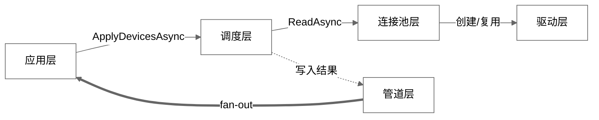
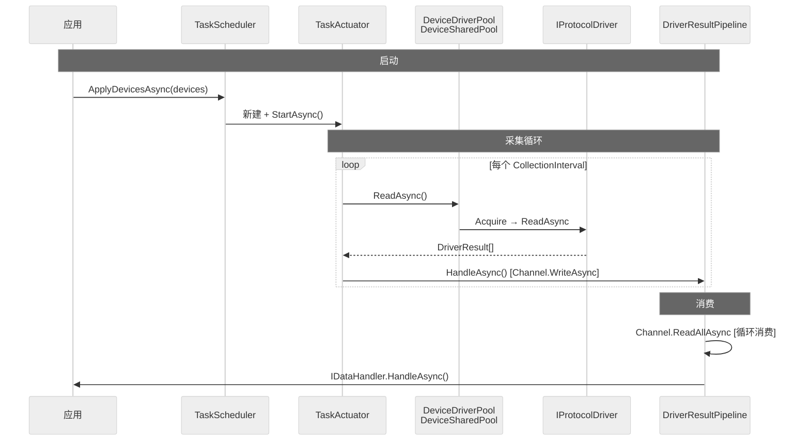
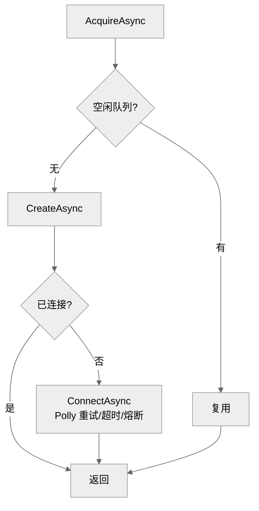
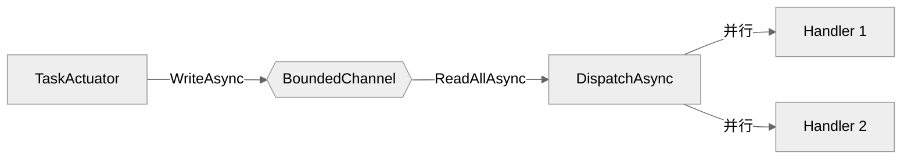
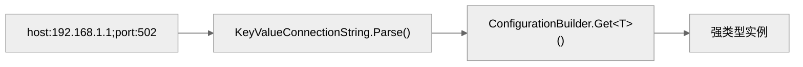
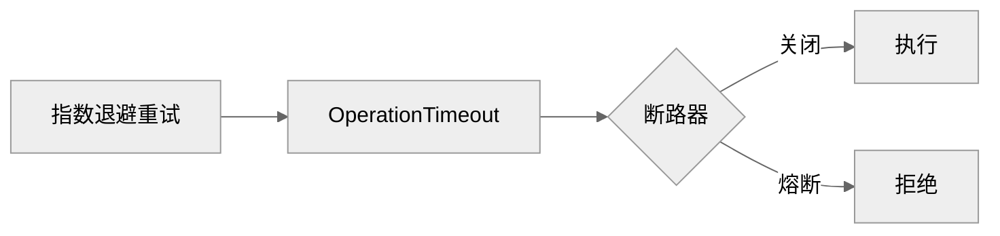

# 开发文档

## 架构总览



| 层 | 核心类 | 职责 |
|------|------|------|
| 应用层 | `IDeviceScheduler` `IDataHandler` | 推送设备配置，接收采集数据 |
| 调度层 | `TaskScheduler` `TaskActuator` `TaskSchedulerHost` | 差量 reconcile，定时采集；`TaskSchedulerHost : BackgroundService` 薄封装接管生命周期 |
| 连接池层 | `DeviceDriverPool` `DeviceSharedPool` | 连接复用，Polly 弹性策略 |
| 驱动层 | `IProtocolDriver`（S7 / Modbus / ...） | 协议通信 |
| 管道层 | `DriverResultPipeline` `PipelineHost` | Channel 消费，fan-out 到 Handler；`PipelineHost : BackgroundService` 薄封装接管生命周期 |

分层原则：上层依赖下层，下层不感知上层。`Channel<DriverResult>` 解耦调度层与管道层。

## 运行时序列



## 分层职责

### 调度层

`TaskScheduler` 实现 `IDeviceScheduler`，纯业务类，不继承框架基类。`TaskSchedulerHost : BackgroundService` 是薄封装，仅接管宿主生命周期：

```csharp
internal sealed class TaskScheduler : IDeviceScheduler
{
    public async Task ApplyDevicesAsync(...) { /* 差量 reconcile */ }
    internal async Task StopSchedulerAsync() { /* 停止所有 TaskActuator */ }
    internal void DisposeResources() { /* 释放 SemaphoreSlim */ }
    internal SchedulerHealthStatus GetHealthStatus() { /* 健康状态 */ }
}

internal sealed class TaskSchedulerHost(TaskScheduler scheduler) : BackgroundService
{
    protected override Task ExecuteAsync(CancellationToken ct) => Task.CompletedTask;

    public override async Task StopAsync(CancellationToken ct)
    {
        await scheduler.StopSchedulerAsync();
        await base.StopAsync(ct);
    }

    public override void Dispose()
    {
        scheduler.DisposeResources();
        base.Dispose();
    }
}
```

- `ApplyDevicesAsync` — 差量 reconcile：对比当前与目标设备列表，新增/更新/移除对应的 `TaskActuator`
- `TaskSchedulerHost.StopAsync` — 宿主关闭时停止所有 `TaskActuator`

`TaskActuator` 每个设备一个实例，内部使用 `PeriodicTimer` 驱动采集循环：

```csharp
// 伪代码
using var timer = new PeriodicTimer(device.CollectionInterval);
while (await timer.WaitForNextTickAsync(ct))
{
    var results = await accessor.ReadAsync(device, points, ct);
    foreach (var r in results)
        await pipeline.HandleAsync(r with { DeviceId = device.Id, TagId = ... }, ct);
}
```

### 连接池层

`DeviceDriverPool` 实现 `IDeviceAccessor`，对外提供 `ReadAsync` / `WriteAsync`。

`DeviceSharedPool` 按连接键分组，每组维护：

| 组件 | 作用 |
|------|------|
| `SemaphoreSlim` | 限制并发连接数（`MaxConnectionsPerDevice`） |
| `ConcurrentQueue<IProtocolDriver>` | 空闲连接队列，先取后建 |
| `ResiliencePipeline` | Polly 弹性管线（重试 + 超时 + 断路器），每设备独立 |

连接池获取流程：



### 管道层

`DriverResultPipeline` 实现 `IDataPipeline`，纯业务类。`PipelineHost : BackgroundService` 是薄封装：

```csharp
internal sealed class DriverResultPipeline : IDataPipeline
{
    public ValueTask HandleAsync(DriverResult result, CancellationToken ct);
    public async Task ConsumeAsync(CancellationToken ct) { /* await foreach channel */ }
    internal void StopConsuming() { /* channel.Writer.TryComplete */ }
    internal void DisposeResources() { /* 释放 Channel + Subscriber */ }
}

internal sealed class PipelineHost(DriverResultPipeline pipeline) : BackgroundService
{
    protected override async Task ExecuteAsync(CancellationToken ct)
        => await pipeline.ConsumeAsync(ct);

    public override async Task StopAsync(CancellationToken ct)
    {
        pipeline.StopConsuming();
        await base.StopAsync(ct);
    }

    public override void Dispose()
    {
        pipeline.DisposeResources();
        base.Dispose();
    }
}
```

`ConsumeAsync` 内 `await foreach` 消费 `Channel<DriverResult>`，fan-out 到所有 `IDataHandler`。

管道消费：



特性：
- 背压控制：`BoundedChannelFullMode.Wait`，消费者跟不上则阻塞生产者
- Handler 并行度：`Parallel.ForEachAsync` + `MaxDegreeOfParallelism` 控制并发，各 Handler 公平调度
- Handler 超时：每个 Handler 独立 `CancellationTokenSource.CancelAfter(HandlerTimeout)`
- 订阅通道背压告警：`IDataPipeline.ReadAsync` 的 sub Channel 满时 `DropOldest` 并记录日志

## 编写自定义驱动

### 1. 连接字符串绑定

连接字符串 `key:value;key:value` → `ConnectionStringBinder.Bind<T>()`：



**简单场景（无 enum 或 enum 兼容）—— 一行：**

```csharp
public static MyConfig Parse(string cs)
    => ConnectionStringBinder.Bind<MyConfig>(cs);
```

**含第三方 enum（如 S7.Net.CpuType）—— Bind + 手动补 enum：**

```csharp
public static S7DriverConfig Parse(string cs)
{
    var config = ConnectionStringBinder.Bind<S7DriverConfig>(cs);
    var dict = KeyValueConnectionString.Parse(cs);
    if (dict.TryGetValue("cpu", out var cpu) && Enum.TryParse<CpuType>(cpu, true, out var t))
        config = config with { CpuType = t };
    return config;
}
```

`Bind<T>()` 处理 int、string、short、bool 等内置类型；第三方 enum 可能绑定失败，通过 `with` 表达式仅覆盖该字段。

### 2. 实现 IProtocolDriver

```csharp
using PlcLibrary.DriverDomain.Attributes;
using PlcLibrary.DriverDomain.Enums;
using PlcLibrary.DriverDomain.Interfaces;
using PlcLibrary.DriverDomain.Models;
using PlcLibrary.General.Configuration;

[ProtocolDriverName("Modbus")]
public sealed class ModbusDriver(ILogger<ModbusDriver> logger, DeviceConfiguration device) : IProtocolDriver
{
    private readonly ModbusDriverConfig _config = ModbusDriverConfig.Parse(device.ConnectionString);

    public DriverStatus DriverStatus { get; private set; }

    public async Task ConnectAsync(CancellationToken ct = default)
    {
        DriverStatus = DriverStatus.Connecting;
        // 建立连接...
        DriverStatus = DriverStatus.Connected;
    }

    public Task DisconnectAsync(CancellationToken ct = default)
    {
        // 断开连接...
        DriverStatus = DriverStatus.Disconnected;
        return Task.CompletedTask;
    }

    public async Task<bool> TryReconnectAsync(CancellationToken ct = default)
    {
        try
        {
            await DisconnectAsync(ct);
            await ConnectAsync(ct);
            return true;
        }
        catch
        {
            DriverStatus = DriverStatus.Faulted;
            return false;
        }
    }

    public async Task<DriverResult[]> ReadAsync(TagPointConfiguration[] points, CancellationToken ct)
    {
        var results = new DriverResult[points.Length];
        for (var i = 0; i < points.Length; i++)
        {
            try
            {
                var value = await ReadPointAsync(points[i].Address, ct);
                results[i] = DriverResult.Good(points[i].Address, value);
            }
            catch (Exception ex)
            {
                results[i] = DriverResult.Bad(points[i].Address, QualityCode.BadCommFailure, ex.Message);
            }
        }
        return results;
    }

    public async Task<DriverResult[]> WriteAsync(
        IReadOnlyDictionary<TagPointConfiguration, object> values, CancellationToken ct)
    {
        var results = new DriverResult[values.Count];
        var i = 0;
        foreach (var (point, value) in values)
        {
            try
            {
                await WritePointAsync(point.Address, value, ct);
                results[i] = DriverResult.Good(point.Address, null);
            }
            catch (Exception ex)
            {
                results[i] = DriverResult.Bad(point.Address, QualityCode.BadCommFailure, ex.Message);
            }
            i++;
        }
        return results;
    }

    public async ValueTask DisposeAsync()
    {
        await DisconnectAsync();
    }
}
```

### 3. 注册

```csharp
// 协议名从 [ProtocolDriverName] 属性自动获取
builder.Services.AddDriver<ModbusDriver>();

// 自定义连接池分组键（同 IP 不同端口可共用池）
builder.Services.AddDriver<ModbusDriver>(cs =>
{
    var c = ModbusDriverConfig.Parse(cs);
    return $"{c.Host}:{c.Port}";
});
```

## 接口参考

### IProtocolDriver

| 成员 | 返回 | 说明 |
|------|------|------|
| `DriverStatus` | `DriverStatus` | Disconnected / Connecting / Connected / Faulted |
| `ConnectAsync(ct)` | `Task` | 建立物理连接，框架通过 Polly 保护调用 |
| `DisconnectAsync(ct)` | `Task` | 断开连接，不应抛异常 |
| `TryReconnectAsync(ct)` | `Task<bool>` | 断开后重连，失败置 Faulted 并返回 false |
| `ReadAsync(points, ct)` | `Task<DriverResult[]>` | 批量读，结果顺序须与输入一致 |
| `WriteAsync(values, ct)` | `Task<DriverResult[]>` | 批量写，结果顺序与输入一致 |
| `DisposeAsync()` | `ValueTask` | 释放资源（`IAsyncDisposable`） |

### DriverResult

```csharp
public readonly record struct DriverResult
{
    public string DeviceId { get; init; }   // 框架自动注入
    public string TagId { get; init; }      // 框架自动注入
    public string Address { get; init; }    // 驱动填写
    public object? Value { get; init; }     // 驱动填写
    public QualityCode Status { get; init; } // 驱动填写
    public string? ErrorMessage { get; init; }
    public DateTime Timestamp { get; init; } // 框架设定 UTC

    public static DriverResult Good(string address, object? value);
    public static DriverResult Bad(string address, QualityCode status, string error);
}
```

驱动只需填写 `Address`、`Value`、`Status`，`DeviceId` 和 `TagId` 由 `TaskActuator` 通过 `with` 表达式注入。

### QualityCode

| 枚举 | 值 | 场景 |
|------|------|------|
| `Good` | 0x00 | 读取正常 |
| `Uncertain` | 0x40 | 数据可信度低 |
| `BadTimeout` | 0x80 | 操作超时 |
| `BadCommFailure` | 0x81 | 通信失败 |
| `BadConfigError` | 0x82 | 配置错误 |
| `BadDeviceFault` | 0x83 | 设备故障 |
| `BadOutOfService` | 0x84 | 设备停用 |
| `Offline` | 0xC0 | 离线 |
| `Initializing` | 0xC1 | 初始化中 |

## 连接池弹性策略

每个 `DeviceSharedPool` 独立维护一条 Polly `ResiliencePipeline`，配置：

```json
{
  "DriverPool": {
    "MaxConnectionsPerDevice": 2,
    "MaxRetryAttempts": 3,
    "RetryDelay": "00:00:01",
    "CircuitBreakerMinimumThroughput": 5,
    "CircuitBreakerDuration": "00:00:30",
    "CircuitBreakerFailureRatio": 0.5,
    "OperationTimeout": "00:00:10"
  }
}
```

策略层级：



- **重试**：`OperationCanceledException` 不重试，其他异常指数退避重试最多 3 次
- **超时**：单次连接操作不超过 10 秒
- **断路器**：连续 5 次操作中失败率 ≥ 50% 触发熔断 30 秒，触发/半开/恢复均有日志输出

每设备独立的 Pipeline 键为 `Pool:{device.Id}`，故障隔离。

## 健康检查

框架内置 `IHealthCheck`，注入 `Microsoft.Extensions.Diagnostics.HealthChecks` 即可使用：

```csharp
builder.Services.AddHealthChecks()
    .AddCheck<PlcLibraryHealthCheck>("plc-library");
```

返回数据包含 `ActiveDevices`（活跃设备数）和 `PoolCount`（连接池数）。

## 连接超时覆盖

`DeviceConfiguration.ConnectionTimeout` 可覆盖全局 `PoolOptions.OperationTimeout`，在 `AcquireAsync` 获取驱动时优先使用设备级超时。默认 `TimeSpan.Zero` 表示使用全局配置。`DeviceSharedPool` 的 Polly 弹性管线也按设备独立创建，断路器回调通过 `ILogger` 输出状态变更（熔断/半开/恢复）。
