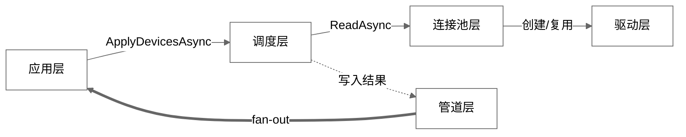
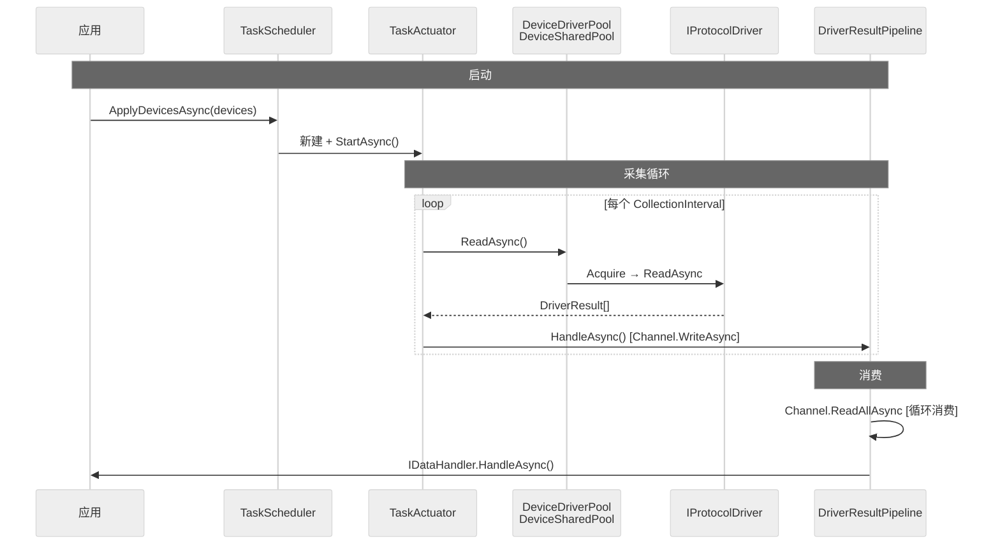
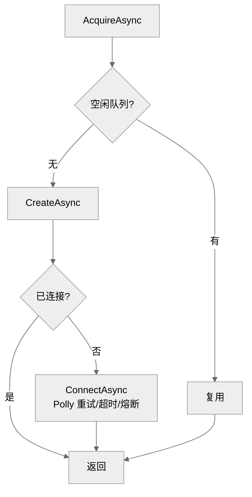
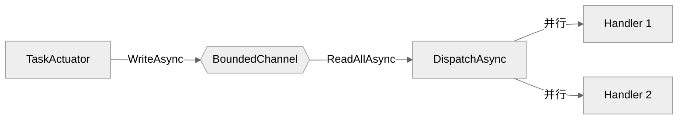
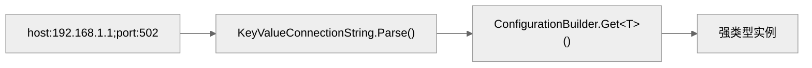
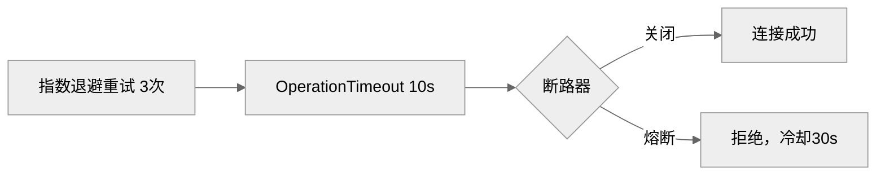
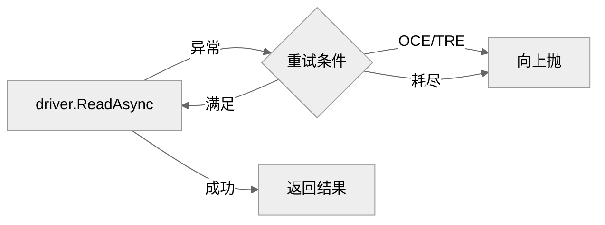

# 开发文档

## 架构总览



| 层 | 核心类 | 职责 |
|------|------|------|
| 应用层 | `IDeviceScheduler` `IDataHandler` | 推送设备配置，接收采集数据 |
| 调度层 | `TaskScheduler` `TaskActuator` `TaskSchedulerHost` | 差量 reconcile，定时采集；`TaskSchedulerHost : BackgroundService` 薄封装接管生命周期 |
| 连接池层 | `DeviceDriverPool` `DeviceSharedPool` | 连接复用，Polly 弹性策略 |
| 驱动层 | `IProtocolDriver`（S7 / Modbus / ...） | 协议通信 |
| 管道层 | `DriverResultPipeline` `PipelineHost` | Channel 消费，fan-out 到 Handler；`PipelineHost : BackgroundService` 薄封装接管生命周期 |

分层原则：上层依赖下层，下层不感知上层。`Channel<DriverResult>` 解耦调度层与管道层。

## 运行时序列



## 分层职责

### 调度层

`TaskScheduler` 实现 `IDeviceScheduler`，纯业务类，不继承框架基类。`TaskSchedulerHost : BackgroundService` 是薄封装，仅接管宿主生命周期：

```csharp
internal sealed class TaskScheduler : IDeviceScheduler
{
    public async Task ApplyDevicesAsync(...) { /* 差量 reconcile */ }
    internal async Task StopSchedulerAsync() { /* 停止所有 TaskActuator */ }
    internal void DisposeResources() { /* 释放 SemaphoreSlim */ }
    public Task<IReadOnlyList<DeviceHealthInfo>> GetDeviceHealthAsync(CancellationToken ct) { /* 健康状态 */ }
}

internal sealed class TaskSchedulerHost(TaskScheduler scheduler) : BackgroundService
{
    protected override Task ExecuteAsync(CancellationToken ct) => Task.CompletedTask;

    public override async Task StopAsync(CancellationToken ct)
    {
        await scheduler.StopSchedulerAsync();
        await base.StopAsync(ct);
    }

    public override void Dispose()
    {
        scheduler.DisposeResources();
        base.Dispose();
    }
}
```

- `ApplyDevicesAsync` — 差量 reconcile：对比当前与目标设备列表，新增/更新/移除对应的 `TaskActuator`
- `TaskSchedulerHost.StopAsync` — 宿主关闭时停止所有 `TaskActuator`

`TaskActuator` 每个设备一个实例，内部使用 `PeriodicTimer` 驱动采集循环：

```csharp
// 伪代码
using var timer = new PeriodicTimer(device.CollectionInterval);
while (await timer.WaitForNextTickAsync(ct))
{
    var results = await accessor.ReadAsync(device, points, ct);
    foreach (var r in results)
        await pipeline.HandleAsync(r with { DeviceId = device.Id, TagId = ... }, ct);
}
```

### 连接池层

`DeviceDriverPool` 实现 `IDeviceAccessor`，对外提供 `ReadAsync` / `WriteAsync`。

`DeviceSharedPool` 按连接键分组，每组维护：

| 组件 | 作用 |
|------|------|
| `SemaphoreSlim` | 限制并发连接数（`MaxConnectionsPerDevice`） |
| `ConcurrentQueue<IProtocolDriver>` | 空闲连接队列，先取后建 |
| `ResiliencePipeline` | Polly 弹性管线（重试 + 超时 + 断路器），跟随连接池（`Pool:{Protocol}|{ConnectionString}`） |

### 池生命周期与回收

- **连接级管线键跟随连接池**（`Pool:{Protocol}|{ConnectionString}`）：多设备共享同一连接串时共享管线；池回收时一并移除。
- **空置 TTL 回收**：`DeviceSharedPool` 维护在途借用计数 `_inUse` 与最后活动时间；`DeviceDriverPool` 内置定时器（60s 周期）扫描，空置超过 `PoolOptions.PoolIdleTimeout`（默认 10 分钟，0 禁用）且无在途借用的池被销毁（释放空闲驱动、移除弹性管线）。热更新频繁增删设备不再累积连接与管线。
- **推送管线**：`Push:{deviceId}` 由 `PushCollector` 创建，随采集器 `DisposeAsync` 移除（订阅是专用长连接，不走池，见下文"Push 双轨设计"）。
- **注册表**：Polly 原生 `ResiliencePipelineRegistry` 只有 `GetOrAddPipeline` 无法移除，库内使用 `ManagedResiliencePipelineRegistry`（包装字典 + `TryRemove`/`Clear`）实现生命周期管理。

### Push 双轨设计（设计决策）

轮询驱动（S7/Modbus/AB/...）的读操作经连接池借用/归还；`IPushProtocolDriver`（OPC UA 订阅）使用**专用长连接**——订阅状态（MonitoredItem、发布队列）绑定驱动实例，池化借用会破坏订阅语义。故 `PushCollector` 为每设备创建独立驱动实例 + 独立连接级弹性管线（`Push:{id}`），与轮询池双轨并存，二者互不干扰。

连接池获取流程：



### 管道层

`DriverResultPipeline` 实现 `IDataPipeline`，纯业务类。`PipelineHost : BackgroundService` 是薄封装：

```csharp
internal sealed class DriverResultPipeline : IDataPipeline
{
    public ValueTask HandleAsync(DriverResult result, CancellationToken ct);
    public async Task ConsumeAsync(CancellationToken ct) { /* await foreach channel */ }
    internal void StopConsuming() { /* channel.Writer.TryComplete */ }
    internal void DisposeResources() { /* 释放 Channel + Subscriber */ }
}

internal sealed class PipelineHost(DriverResultPipeline pipeline) : BackgroundService
{
    protected override async Task ExecuteAsync(CancellationToken ct)
        => await pipeline.ConsumeAsync(ct);

    public override async Task StopAsync(CancellationToken ct)
    {
        pipeline.StopConsuming();
        await base.StopAsync(ct);
    }

    public override void Dispose()
    {
        pipeline.DisposeResources();
        base.Dispose();
    }
}
```

`ConsumeAsync` 内 `await foreach` 消费 `Channel<DriverResult>`，fan-out 到所有 `IDataHandler`。

管道消费：



特性：
- 背压控制：`BoundedChannelFullMode.Wait`，消费者跟不上则阻塞生产者
- Handler 并行度：`Parallel.ForEachAsync` + `MaxDegreeOfParallelism` 控制并发，各 Handler 公平调度
- Handler 超时：每个 Handler 独立 `CancellationTokenSource.CancelAfter(HandlerTimeout)`
- 订阅通道背压告警：`IDataPipeline.ReadAsync` 的 sub Channel 满时 `DropOldest` 并记录日志

## 编写自定义驱动

### 1. 连接字符串绑定

连接字符串 `key:value;key:value` → `ConnectionStringBinder.Bind<T>()`：



**简单场景（无 enum 或 enum 兼容）—— 一行：**

```csharp
public static MyConfig Parse(string cs)
    => ConnectionStringBinder.Bind<MyConfig>(cs);
```

**含第三方 enum（如 S7.Net.CpuType）—— Bind + 手动补 enum：**

```csharp
public static S7DriverConfig Parse(string cs)
{
    var config = ConnectionStringBinder.Bind<S7DriverConfig>(cs);
    var dict = KeyValueConnectionString.Parse(cs);
    if (dict.TryGetValue("cpu", out var cpu) && Enum.TryParse<CpuType>(cpu, true, out var t))
        config = config with { CpuType = t };
    return config;
}
```

`Bind<T>()` 处理 int、string、short、bool 等内置类型；第三方 enum 可能绑定失败，通过 `with` 表达式仅覆盖该字段。

> **配置-消费约束**：新增的驱动配置字段**必须**在驱动源码中被消费（`_config.X` 引用）。
> `DriverConfigConsumptionTests` 会逐一断言每个 `*DriverConfig` 公共属性都被对应驱动引用，
> 防止"文档声称可配、代码未生效"类问题（曾出现 OPC UA security、BACnet deviceinstance 等）。
> 若某字段确因第三方库限制无法应用，必须加入该测试的 `KnownUnused` 例外清单并注明原因。

### 1.1 数据类型映射

当驱动需要根据 `TagPointConfiguration.DataType` 确定读写类型时，使用共享的 `DataTypeMapper`：

```csharp
using PlcLibrary.DriverDomain.Parser;

var type = DataTypeMapper.Resolve(points[i].DataType);
// type: typeof(int), typeof(float), typeof(bool), 等
// 未指定 DataType 时默认返回 typeof(int)
```

支持的类型简写：`bool`/`short`/`ushort`/`int`/`uint`/`long`/`ulong`/`float`/`double`/`string` 以及对应的 `System.Xxx` 完整名称。

### 2. 实现 IProtocolDriver

```csharp
using PlcLibrary.DriverDomain.Attributes;
using PlcLibrary.DriverDomain.Enums;
using PlcLibrary.DriverDomain.Interfaces;
using PlcLibrary.DriverDomain.Models;
using PlcLibrary.General.Configuration;

[ProtocolDriverName("MyProtocol")]
public sealed class MyProtocolDriver(ILogger<MyProtocolDriver> logger, DeviceConfiguration device) : IProtocolDriver
{
    private readonly MyProtocolConfig _config = MyProtocolConfig.Parse(device.ConnectionString);

    public DriverStatus DriverStatus { get; private set; }

    public async Task ConnectAsync(CancellationToken ct = default)
    {
        DriverStatus = DriverStatus.Connecting;
        // 建立连接...
        DriverStatus = DriverStatus.Connected;
    }

    public Task DisconnectAsync(CancellationToken ct = default)
    {
        // 断开连接...
        DriverStatus = DriverStatus.Disconnected;
        return Task.CompletedTask;
    }

    public async Task<bool> TryReconnectAsync(CancellationToken ct = default)
    {
        try
        {
            await DisconnectAsync(ct);
            await ConnectAsync(ct);
            return true;
        }
        catch
        {
            DriverStatus = DriverStatus.Faulted;
            return false;
        }
    }

    public async Task<DriverResult[]> ReadAsync(TagPointConfiguration[] points, CancellationToken ct)
    {
        var results = new DriverResult[points.Length];
        for (var i = 0; i < points.Length; i++)
        {
            try
            {
                var value = await ReadPointAsync(points[i].Address, ct);
                results[i] = DriverResult.Good(points[i].Address, value);
            }
            catch (Exception ex)
            {
                results[i] = DriverResult.Bad(points[i].Address, QualityCode.BadCommFailure, ex.Message);
            }
        }
        return results;
    }

    public async Task<DriverResult[]> WriteAsync(
        IReadOnlyDictionary<TagPointConfiguration, object> values, CancellationToken ct)
    {
        var results = new DriverResult[values.Count];
        var i = 0;
        foreach (var (point, value) in values)
        {
            try
            {
                await WritePointAsync(point.Address, value, ct);
                results[i] = DriverResult.Good(point.Address, null);
            }
            catch (Exception ex)
            {
                results[i] = DriverResult.Bad(point.Address, QualityCode.BadCommFailure, ex.Message);
            }
            i++;
        }
        return results;
    }

    public async ValueTask DisposeAsync()
    {
        await DisconnectAsync();
    }
}
```

### 3. 注册

```csharp
// 协议名从 [ProtocolDriverName] 属性自动获取
builder.Services.AddDriver<ModbusDriver>();
```

## 接口参考

### IProtocolDriver

| 成员 | 返回 | 说明 |
|------|------|------|
| `DriverStatus` | `DriverStatus` | Disconnected / Connecting / Connected / Faulted |
| `ConnectAsync(ct)` | `Task` | 建立物理连接，框架通过 Polly 保护调用 |
| `DisconnectAsync(ct)` | `Task` | 断开连接，不应抛异常 |
| `TryReconnectAsync(ct)` | `Task<bool>` | 断开后重连，失败置 Faulted 并返回 false |
| `ReadAsync(points, ct)` | `Task<DriverResult[]>` | 批量读，结果顺序须与输入一致 |
| `WriteAsync(values, ct)` | `Task<DriverResult[]>` | 批量写，结果顺序与输入一致 |
| `DisposeAsync()` | `ValueTask` | 释放资源（`IAsyncDisposable`） |

### DriverResult

```csharp
public readonly record struct DriverResult
{
    public string DeviceId { get; init; }   // 框架自动注入
    public string TagId { get; init; }      // 框架自动注入
    public string Address { get; init; }    // 驱动填写
    public object? Value { get; init; }     // 驱动填写
    public QualityCode Status { get; init; } // 驱动填写
    public string? ErrorMessage { get; init; }
    public DateTime Timestamp { get; init; } // 框架设定 UTC

    public static DriverResult Good(string address, object? value);
    public static DriverResult Bad(string address, QualityCode status, string error);
}
```

驱动只需填写 `Address`、`Value`、`Status`，`DeviceId` 和 `TagId` 由 `TaskActuator` 通过 `with` 表达式注入。

### QualityCode

| 枚举 | 值 | 场景 |
|------|------|------|
| `Good` | 0x00 | 读取正常 |
| `Uncertain` | 0x40 | 数据可信度低 |
| `BadTimeout` | 0x80 | 操作超时 |
| `BadCommFailure` | 0x81 | 通信失败 |
| `BadConfigError` | 0x82 | 配置错误 |
| `BadDeviceFault` | 0x83 | 设备故障 |
| `BadOutOfService` | 0x84 | 设备停用 |
| `Offline` | 0xC0 | 离线 |
| `Initializing` | 0xC1 | 初始化中 |

## 连接池弹性策略

Polly 弹性分为两级，每设备独立隔离：

**连接级** — `DeviceSharedPool.AcquireAsync`

连接获取时包入 Polly 管线，在 `ConnectAsync` / `TryReconnectAsync` 阶段生效。策略链：



**IO 级** — `DeviceDriverPool.ReadAsync` / `WriteAsync`

每次 `ReadAsync`/`WriteAsync` **抛出异常**时自动重试，在同一驱动实例上执行，排除 `OperationCanceledException` 和 `TimeoutRejectedException`。



**断线检测与自动重连**（驱动层契约）：

- 驱动在批量读/写捕获到**传输级故障**（`SocketException`/`IOException`/`TimeoutException`/`ObjectDisposedException`，由 `TransportFailureDetector` 判定）时，应将 `DriverStatus` 置为 `Faulted`，同时保留逐点 `DriverResult.Bad` 语义（不重抛）。
- 连接池 `DeviceSharedPool.Return` 见 `Faulted` 驱动即丢弃并释放连接额度；下次 `AcquireAsync` 创建新驱动并走连接级弹性（重试 + 断路器），实现"坏连接自动淘汰、PLC 恢复后自动重建"。
- 点位级/业务级错误（设备返回错误码、地址不存在等）**不应**置 `Faulted`，避免误触发重建。

两级策略均复用 `PoolOptions` 中的 `MaxRetryAttempts`、`RetryDelay`、`OperationTimeout` 配置项。

每设备独立的 Pipeline 键为 `Pool:{device.Id}`（连接级）和 `IO:{device.Id}`（IO 级，通过 `DeviceDriverPool` 内置 builder 创建），故障隔离。

## 可观测性

### Meter: `PlcLibrary`

通过 `System.Diagnostics.Metrics`（`System.Diagnostics.DiagnosticSource` 包，.NET 6+ 默认引用）暴露指标，无需额外 NuGet 包。

| 指标名 | 类型 | 说明 |
|---|---|---|
| `plc.reads.total` | `Counter<long>` | 累计采集点数（带 device.id/device.protocol 标签） |
| `plc.read.duration` | `Histogram<double>` | ReadAsync 耗时分布（s），含 IO 重试 |
| `plc.read.errors` | `Counter<long>` | ReadAsync 最终失败次数 |
| `plc.write.total` | `Counter<long>` | 累计写操作数 |
| `plc.acquire.duration` | `Histogram<double>` | 连接池获取驱动耗时（s），含 connect |
| `plc.pipeline.dispatched` | `Counter<long>` | 管道分发点数（带 device.id 标签） |
| `plc.pipeline.dropped` | `Counter<long>` | 订阅通道溢出丢弃数 |

### 分布式追踪（ActivitySource）

库内埋点 `ActivitySource("PlcLibrary")`（见 `PlcActivity`），与指标对称——只埋不接，宿主接 OpenTelemetry 消费：

| Span | 埋点位置 | 标签 |
|------|---------|------|
| `PlcLibrary.ReadAsync` | `DeviceDriverPool.ReadAsync` | device.id / device.protocol / point.count |
| `PlcLibrary.WriteAsync` | `DeviceDriverPool.WriteAsync` | device.id / device.protocol / point.count |
| `PlcLibrary.Acquire` | `DeviceSharedPool.AcquireAsync` | device.id / device.protocol |
| `PlcLibrary.Dispatch` | `DriverResultPipeline.DispatchAsync` | device.id / tag.id / status |

无监听器时开销可忽略；基础库不引用任何 OpenTelemetry 包。

### 批量读设计

| 驱动 | 批量方式 | 失败策略 |
|------|---------|---------|
| Modbus | 连续地址合并 + PDU 上限切分（组级隔离） | 组失败 → 该组 Bad + 传输级置 Faulted |
| S7 | `ReadMultipleVarsAsync` + 逐点回退 | 批量失败 → 逐点回退 |
| AllenBradley | `ReadMultipleAsync` 原始字节 + CIP 小端解码 | 批量失败 → 逐点回退；string 始终逐点 |
| BACnet | `ReadPropertyMultipleAsync` 按对象分组 | 整批失败 → 全部 Bad + 传输级置 Faulted |
| Omron | **暂未启用**：底层 `BatchReadAsync` 已确认存在，但 FINS 字节序（CDAB）与 length 单位（字/字节）无法离线验证，且库内无公共转换助手——为避免静默数据错误（见 Modbus P0 修复先例），待接入真实 FINS 设备（或回环服务器实测）后启用 | - |

原则：**批量读不得引入数据正确性风险**；解码路径必须有可验证依据（Modbus 用 NModbus 返回数组、AB 用 CIP 小端规范、BACnet 用结构化结果），无法验证的字节序类优化宁可推迟。

### 接入 OpenTelemetry

```csharp
// Program.cs
builder.Services.AddOpenTelemetry()
    .WithMetrics(m => m
        .AddMeter("PlcLibrary")
        .AddPrometheusExporter());
```

### 接入 dotnet-counters

```bash
dotnet-counters monitor -n <进程名> --counters PlcLibrary
```

实时输出：

```
[PlcLibrary]
    plc.reads.total (points)                    15420
    plc.read.duration (s)
        quantile=0.50                            0.012
        quantile=0.95                            0.087
        quantile=0.99                            0.310
    plc.read.errors (errors)                        2
    plc.acquire.duration (s)
        quantile=0.50                            1.203
```

### 指标埋点位置

| 指标 | 埋点位置 |
|---|---|
| `plc.reads.total` | `DeviceDriverPool.ReadAsync` — IO 重试成功后 |
| `plc.read.duration` | `DeviceDriverPool.ReadAsync` — 含 IO 重试完整耗时 |
| `plc.read.errors` | `DeviceDriverPool.ReadAsync` — catch 块，含重试耗尽 |
| `plc.write.total` | `DeviceDriverPool.WriteAsync` |
| `plc.acquire.duration` | `DeviceSharedPool.AcquireAsync` — 含 connect 耗时 |
| `plc.pipeline.dispatched` | `DriverResultPipeline.DispatchAsync` |
| `plc.pipeline.dropped` | `DriverResultPipeline.DispatchAsync` — 订阅通道 TryWrite 失败 |

## 连接超时覆盖

`DeviceConfiguration.ConnectionTimeout` 可覆盖全局 `PoolOptions.OperationTimeout`，在 `AcquireAsync` 获取驱动时优先使用设备级超时。默认 `00:00:05`；设为 `TimeSpan.Zero` 时使用全局配置。`DeviceSharedPool` 的 Polly 弹性管线也按设备独立创建，断路器回调通过 `ILogger` 输出状态变更（熔断/半开/恢复）。
